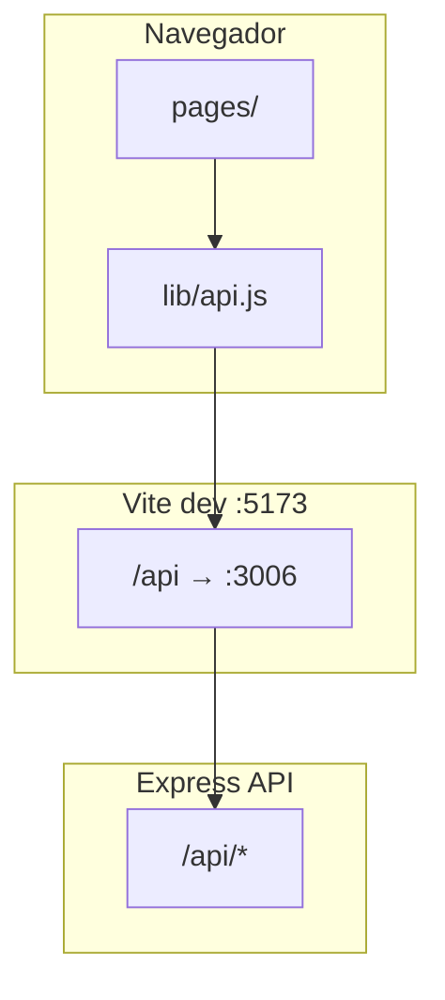

# Guía de desarrollo — Frontend

## Arquitectura



## Rutas (`src/App.jsx`)

| Ruta | Componente | Protegida |
|------|------------|-----------|
| `/login` | LoginPage | No |
| `/callback-microsoft` | MicrosoftCallbackPage | No |
| `/registro` | RegisterPage | No |
| `/verificar-cuenta` | VerifyEmailPage | No |
| `/recuperar`, `/restablecer` | Forgot/Reset | No |
| `/` | HomeRedirect | Sí |
| `/asistencia` | AsistenciaPage | Sí |
| `/historial` | HistorialPage | Sí |
| `/informacion` | InformacionPage | Sí |
| `/rubricas` | GestionRubricasPage | Sí |
| `/reportes` | ReportesPage | Sí |
| `/administrador` | AdministradorPage | Sí |

Layout protegido: `RequireAuth` → `AppShell` → `<Outlet />`.

## Autenticación

### Almacenamiento del token

- `sessionStorage.accessToken` — sesión de pestaña
- `localStorage.accessToken` — “Recordarme”

Funciones en `src/lib/api.js`: `getStoredToken`, `setStoredToken`, `setSessionToken`.

### Flujo Microsoft

1. `GET /api/auth/microsoft/url`
2. Redirect Azure → backend `/callback-microsoft` → frontend `/callback-microsoft?code=`
3. `POST /api/auth/microsoft/token` con `VITE_MICROSOFT_REDIRECT_URI`

### Guard `RequireAuth`

- Comprueba token y expiración JWT en cliente.
- Redirige a `/login` si falta o expiró.

### AppShell

- `GET /api/auth/me` para perfil.
- Filtra ítem **Administrador** si `user.rol !== 'Administrador'`.
- Rol **Desarrollador:** botón que abre `/api-docs?access_token=...`.

## Cliente API (`src/lib/api.js`)

```js
import { getJson, postJson, apiFetch, apiUrl } from './lib/api.js';

// GET con Bearer automático
const data = await getJson('/api/cursos?correo=...');

// POST JSON
await postJson('/api/asistencia', body);

// Multipart
await apiFetch('/api/evaluaciones', { method: 'POST', body: formData });
```

- `401` → limpia token y redirige a login.
- `VITE_API_URL` vacío → rutas relativas (proxy Vite).

## Feature flags del menú

`src/lib/navFeatures.js` lee `VITE_VIEW_*`. Si todas están en `false`, se muestra al menos Asistencia.

`HomeRedirect` envía a `/administrador` si el usuario es admin y la vista está habilitada; si no, al primer ítem del menú.

## TanStack Query

- Provider: `src/providers/AppProviders.jsx`
- Cliente: `src/lib/queryClient.js`
- Claves habituales: `['auth','me']`, `['cursos', ...]`, `['asistencia', ...]`

## Estilos

- Tema global: `src/styles/club-theme.css`
- Módulo asistencia: `src/styles/asistencia/*`
- Convenciones z-index: [CSS_STACKING.md](CSS_STACKING.md)

## Build de producción

```bash
npm run build
```

Configure `VITE_API_URL` con la URL pública del API (sin proxy).

## Enlaces útiles

- [README del frontend](../README.md)
- [API backend](../../backend/docs/API.md)
- [OpenAPI / Swagger](../../backend/docs/openapi.yaml)
