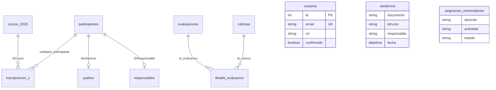

# Base de datos — Modelo y relaciones

El backend usa **Sequelize 6** sobre **MySQL**. El esquema de tablas **ya existe** en el servidor del club; las carpetas `migrations/` y `seeders/` están preparadas para cambios futuros pero pueden estar vacías.

Zona horaria de Sequelize: **America/Bogota** (`-05:00`).

## Diagrama entidad-relación (lógico)



## Tablas y modelos Sequelize

| Tabla MySQL | Modelo | Archivo |
|-------------|--------|---------|
| `usuarios` | Usuarios | `UsuariosModel.js` |
| `cursos_2025` | Cursos | `CursosModel.js` |
| `inscripciones_1` | Inscripciones | `InscripcionesModel.js` |
| `participantes` | Participantes | `ParticipantesModel.js` |
| `padres` | Padres | `PadresModel.js` |
| `responsables` | Responsable | `ResponsableModel.js` |
| `asistencia` | Asistencia | `AsistenciaModel.js` |
| `asignacion_entrenadores` | Asignaciones | `AsignacionModel.js` |
| `entrenadores` | Entrenadores | `EntrenadoresModel.js` |
| `rubricas` | Rubricas | `RubricasModel.js` |
| `evaluaciones` | Evaluaciones | `EvaluacionesModel.js` |
| `detalle_evaluacion` | DetalleEvaluacion | `DetalleEvaluacionModel.js` |
| `informe_email_jobs` | InformeEmailJob | `InformeEmailJobModel.js` |
| `example_models` | ExampleModel | `ExampleModel.js` (plantilla) |

## Asociaciones declaradas en código

### Inscripciones

- `Inscripciones.belongsTo(Cursos)` — `IDCurso` → `ID_Curso` (alias `curso`)
- `Inscripciones.belongsTo(Participantes)` — `validador_participante` → `idParticipante` (alias `participante`)

### Participantes

- `Participantes.hasOne(Padres)` — `idParticipante` = `docAlumno` (alias `padreInfo`)
- `Participantes.hasOne(Responsable)` — `responsable` = `IDResponsable` (alias `responsableInfo`)

### Evaluaciones

- `Evaluaciones.hasMany(DetalleEvaluacion)` — alias `detalles`
- `DetalleEvaluacion.belongsTo(Rubricas)` — alias `rubrica`

## Tablas sin asociación Sequelize (uso directo)

| Tabla | Uso en la aplicación |
|-------|----------------------|
| `asistencia` | Registro diario por documento, curso y responsable |
| `asignacion_entrenadores` | Qué cursos/actividades ve cada docente (`docente` = email) |
| `entrenadores` | Metadatos de entrenadores en informes |
| `usuarios` | Login proveedor, administrador Microsoft, desarrollador |
| `informe_email_jobs` | Cola asíncrona de envío de informes por correo |

## Filtros habituales en consultas

- **Inscripciones:** `Tipo = 1`, `año` actual, `Mes` actual, `Estado` (`CONFIRMADO`, `ACTIVO`, etc.)
- **Cursos:** `Estado_del_curso = ACTIVO`, `Tipo = 1`
- **Asignaciones:** `estado = ACTIVO`, opcional `lider = Si`

## Rol Desarrollador en `usuarios`

Los usuarios con `rol = 'Desarrollador'` se crean **manualmente** en la base (no hay registro público):

```sql
INSERT INTO usuarios (usuarioid, email, password, rol, confirmado, nombre)
VALUES (
  'doc_dev',
  'dev@ejemplo.com',
  '$2b$10$...',  -- hash bcrypt de la contraseña
  'Desarrollador',
  1,
  'Desarrollador API'
);
```

Generar hash con Node: `bcrypt.hash('tu_password', 10)`.

## Guía Sequelize

Comandos CRUD y CLI: [sequelize-guide.md](sequelize-guide.md).
